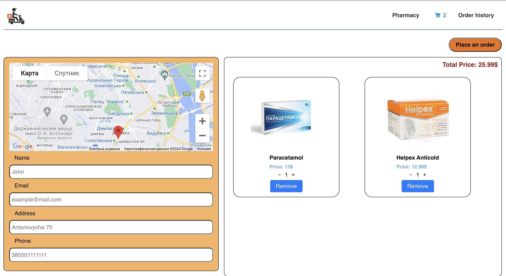

MEDICATES DELIVERY-APP

This Medicate delivery application is built with Vite and React.

Getting Started
To get started with this project, follow these steps:

Clone the repository:

git clone <https://github.com/Ra4kovi4/med_orders-eliftech_test_client.git>

Install project dependencies:

npm install
Start the application:

npm start
Open http://localhost:5174/ in your web browser to view the application.

Backend Repository
You can find the backend repository for this project at

https://github.com/Ra4kovi4/med_orders-eliftech_test_service.git

Home page
On the home page you will find a list of all available pharmacies and medications.

Home page - step 1

Select a pharmacy and medication to place your order and add to your basket. You can sort the medicines by price

Cart page - step 2

Go to your cart and check your order. You will also be able to see on the map the location of the pharmacies where you ordered the drug. You can also increase or decrease the number of medicines you order

Cart page - step 3

Enter your details to checkout and place your order

Order history page - step 3

Choose the way you want to find your order (email/phone number)

